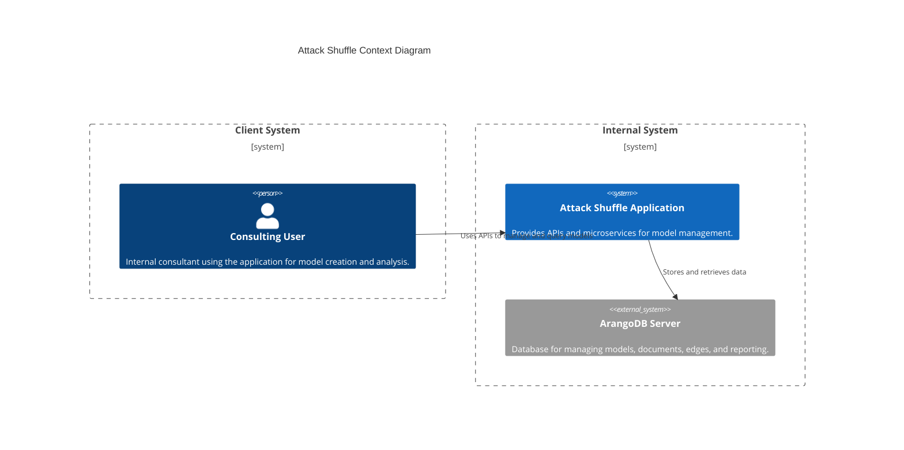
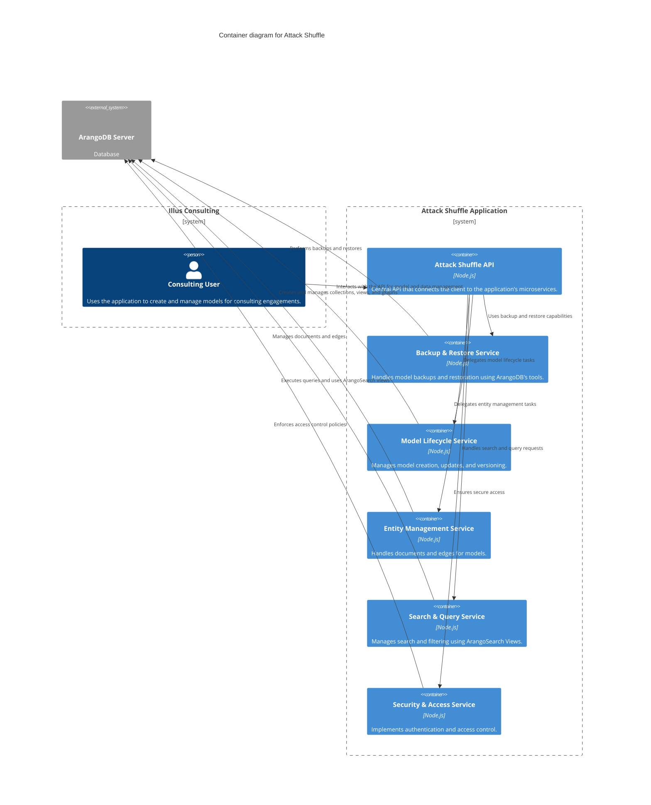
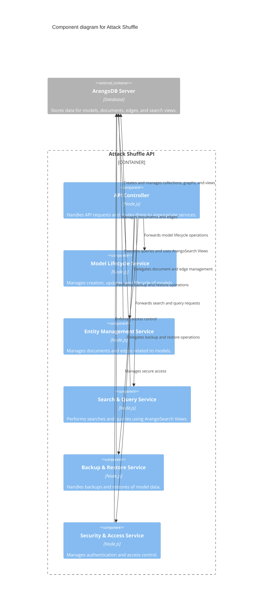
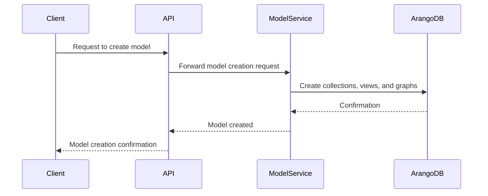
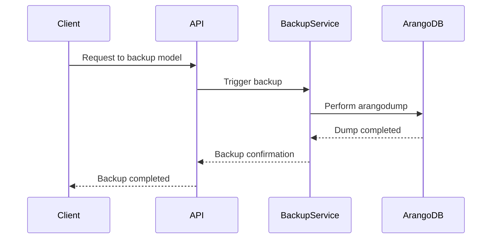

# **Attack Shuffle**

## **Overview**

Attack Shuffle is an internal tool developed by Illus Consulting to make measuring, maximizing, and maturing threat-informed defense more accessible to organizations of all sizes. The application is designed to support consulting engagements by enabling the creation, management, and analysis of models that depict relationships between environments, asset types, attack techniques, controls, and security functions.

Leveraging data-driven methodologies and threat-informed frameworks, the application helps streamline and enhance consulting deliverables while maintaining control and security of the underlying data and architecture. By using ArangoDB and a suite of microservices, Attack Shuffle allows consultants to:

Understand and analyze their threat landscapes.
Model and measure defenses against adversary techniques.
Explore opportunities for maximizing security investments and operational maturity.

---

## **File and Folder Structure**

The project is organized as follows:
```
attack-shuffle/
├── docker-compose.yml
├── arangodb/
│   ├── init/
│   │   ├── init-database.js      # Initializes the database
│   │   ├── create-collections.js # Creates required collections
│   │   ├── create-views.js       # Creates ArangoSearch views
│   │   └── create-graphs.js      # Creates graphs
│   └── data/                     # Directory for persisted database storage
├── services/
│   ├── model-lifecycle/
│   │   ├── index.js              # Main entry point for model lifecycle service
│   │   ├── manifest.json         # Metadata for the service
│   │   └── utils/
│   │       └── lifecycle-utils.js # Utility functions for model lifecycle
│   ├── entity-management/
│   │   ├── index.js
│   │   ├── manifest.json
│   │   └── utils/
│   │       └── entity-utils.js
│   ├── search-and-query/
│   │   ├── index.js
│   │   ├── manifest.json
│   │   └── utils/
│   │       └── search-utils.js
│   ├── backup-and-restore/
│   │   ├── index.js
│   │   ├── manifest.json
│   │   └── utils/
│   │       └── backup-utils.js
│   └── security-and-access/
│       ├── index.js
│       ├── manifest.json
│       └── utils/
│           └── access-utils.js
├── scripts/
│   ├── deploy-foxx-services.sh
│   ├── initialize-arangodb.sh
│   └── backup-models.sh
├── config/
│   ├── arango.env                # Environment variables for ArangoDB
│   ├── foxx.env                  # Environment variables for Foxx services
│   └── backup-config.json        # Configuration for backup/restore
├── logs/
│   └── .gitkeep                  # Placeholder to ensure the directory exists
└── README.md
```

---

## **Architecture**

### **Context Diagram**



---

### **C4 Container Diagram**



### **C4 Component Diagram**



---

## **Sequence Diagrams**

### **Model Creation**



### **Backup a Model**



---

## **Licensing**

This project is **dual-licensed** under the following terms:

### **1. GNU General Public License v3.0 (GPLv3)**

- Applies to all scripts and code specific to this project, including:
  - `services/`
  - `scripts/`
- The GPLv3 allows you to:
  - Use, modify, and redistribute the code under the same license.
  - Ensure freedom for other users to do the same.
- Full license text: [GPLv3](https://choosealicense.com/licenses/gpl-3.0/)

### **2. ArangoDB Community License**

- Applies to the **ArangoDB Community Edition** used in this project.
- The ArangoDB Community License:
  - Permits internal use of ArangoDB for applications such as this.
  - Restricts redistributing ArangoDB Community Edition as part of a product or service.
  - Full license text: [Community License](https://arangodb.com/wp-content/uploads/2024/05/ADB-Community-License_31OCT2023.pdf)

---

## **Acknowledgments**

- **ArangoDB Community Edition** is the core database powering this application. Learn more at [ArangoDB](https://arangodb.com).
- This project respects the terms of all dependencies and ensures compliance with the applicable licenses.

This project builds on the incredible work of organizations and individuals committed to advancing threat-informed defense and cybersecurity maturity. We gratefully acknowledge the following:

### **Threat-Informed Frameworks**

- [MITRE ATT&CK](https://attack.mitre.org/) – The industry standard for adversary tactics and techniques.
- [MITRE Engenuity Center for Threat-Informed Defense (CTID)](https://mitre-engenuity.org/cybersecurity/center-for-threat-informed-defense/) – Advancing collaborative research in cybersecurity.
- [CTID ATT&CK Mappings Explorer](https://mitre-engenuity.org/cybersecurity/center-for-threat-informed-defense/our-work/mappings-explorer/) – A tool for exploring ATT&CK mappings.
- [CTID Top ATT&CK Techniques](https://top-attack-techniques.mitre-engenuity.org/#/) – Highlights the most commonly used ATT&CK techniques.
- [CTID Measure, Maximize, and Mature Threat-Informed Defense (M3TID)](https://center-for-threat-informed-defense.github.io/m3tid/) – A framework to improve threat-informed defense maturity.
- [CTID ATT&CK Flow](https://center-for-threat-informed-defense.github.io/attack-flow/) – A model for visualizing adversary behaviors and attack scenarios.

### **Cybersecurity Maturity Models**

- [Center for Internet Security (CIS) Community Defense Model (CDM)](https://www.cisecurity.org/insights/white-papers/cis-community-defense-model-2-0) – Maps defensive measures to common cyber threats.
- [Sounil Yu’s Cyber Defense Matrix](https://cyberdefensematrix.com/) – A framework for organizing and evaluating cybersecurity capabilities.

### **Community Contributions**

- [Matt Adams’ STRIDE GPT](https://github.com/mrwadams/stride-gpt) – A tool for automating STRIDE threat modeling.
- [Matt Adams’ AttackGen](https://github.com/mrwadams/attackgen) – A generator for simulated attack scenarios.

### **Thought Leadership**

- [Douglas Hubbard & Richard Seiersen’s *How to Measure Anything in Cybersecurity Risk*](https://www.howtomeasureanything.com/cybersecurity/) – Foundational concepts for quantifying and improving cybersecurity risk management.

These resources have inspired and informed the development of **Attack Shuffle**, making it a valuable tool for promoting threat-informed defense across organizations of all sizes.

---
