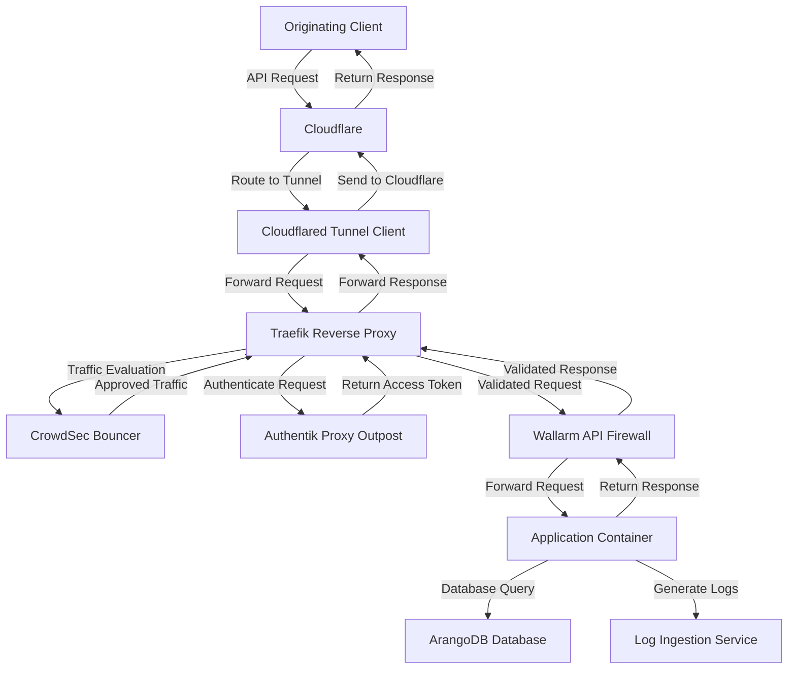
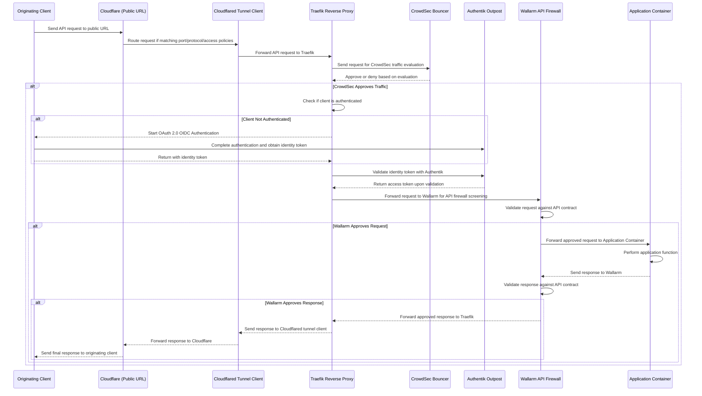

# Diagrams

```mermaid
graph TD
  %% Client and External Routing
  Client[Originating Client]
  Cloudflare[Cloudflare]
  Cloudflared[Cloudflared Tunnel Client]
  
  %% Routing and Security Layers
  Traefik[Traefik Reverse Proxy]
  CrowdSec[CrowdSec Bouncer]
  Authentik[Authentik Proxy Outpost]
  Wallarm[Wallarm API Firewall]
  
  %% Application Layer
  App[Application Container]
  ArangoDB[ArangoDB Database]
  Logs[Log Ingestion Service]

  %% Connections
  Client -->|API Request| Cloudflare
  Cloudflare -->|Route to Tunnel| Cloudflared
  Cloudflared -->|Forward Request| Traefik

  %% CrowdSec and Authentication Flow
  Traefik -->|Traffic Evaluation| CrowdSec
  CrowdSec -->|Approved Traffic| Traefik
  Traefik -->|Authenticate Request| Authentik
  Authentik -->|Return Access Token| Traefik

  %% API Firewall Screening
  Traefik -->|Validated Request| Wallarm
  Wallarm -->|Forward Request| App

  %% Application Execution and Response
  App -->|Database Query| ArangoDB
  App -->|Generate Logs| Logs
  App -->|Return Response| Wallarm

  %% Response Screening and Return Path
  Wallarm -->|Validated Response| Traefik
  Traefik -->|Forward Response| Cloudflared
  Cloudflared -->|Send to Cloudflare| Cloudflare
  Cloudflare -->|Return Response| Client
```

## Sequence Diagram

```mermaid
sequenceDiagram
  participant Client as Originating Client
  participant Cloudflare as Cloudflare (Public URL)
  participant Cloudflared as Cloudflared Tunnel Client
  participant Traefik as Traefik Reverse Proxy
  participant CrowdSec as CrowdSec Bouncer
  participant Authentik as Authentik Outpost
  participant Wallarm as Wallarm API Firewall
  participant App as Application Container

  %% Request Flow
  Client->>Cloudflare: Send API request to public URL
  Cloudflare->>Cloudflared: Route request if matching port/protocol/access policies
  Cloudflared->>Traefik: Forward API request to Traefik

  %% Traffic Evaluation
  Traefik->>CrowdSec: Send request for CrowdSec traffic evaluation
  CrowdSec-->>Traefik: Approve or deny based on evaluation

  %% Authentication Flow
  alt CrowdSec Approves Traffic
    Traefik->>Traefik: Check if client is authenticated
    alt Client Not Authenticated
      Traefik-->>Client: Start OAuth 2.0 OIDC Authentication
      Client->>Authentik: Complete authentication and obtain identity token
      Client-->>Traefik: Return with identity token
    end
    Traefik->>Authentik: Validate identity token with Authentik
    Authentik-->>Traefik: Return access token upon validation

    %% API Firewall Screening
    Traefik->>Wallarm: Forward request to Wallarm for API firewall screening
    Wallarm->>Wallarm: Validate request against API contract
    alt Wallarm Approves Request
      Wallarm->>App: Forward approved request to Application Container

      %% Application Execution
      App->>App: Perform application function
      App-->>Wallarm: Send response to Wallarm

      %% Response Screening
      Wallarm->>Wallarm: Validate response against API contract
      alt Wallarm Approves Response
        Wallarm-->>Traefik: Forward approved response to Traefik
        Traefik-->>Cloudflared: Send response to Cloudflared tunnel client
        Cloudflared-->>Cloudflare: Forward response to Cloudflare
        Cloudflare-->>Client: Send final response to originating client
      end
    end
  end
```
